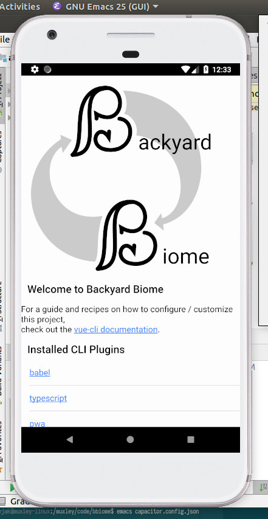

***********************************
Garden Planning/Modeling Brainstorm
***********************************

2018-09-07 (guessed on 9/15)

Should start with macro pieces that are well known pieces: Keyhole,
espalier, swale, spiral, hugelkultur, high yield techniques (1 sq ft
pieces of raised beds).

Should maybe also focus on neighborhood gains first -- sharing economy
and community building. Can this be integrated into an existing app?
NextDoor? Craigslist?

The modeling would be inspired by AEDT, be a generative model that
predicts relative sizes of a crop over time based on calculations of
microclimates and resources.

 * need fuzzy and hard collision detection
 * each crop can just be represented as stacked geometric shapes with
   spring constants for collision. This may work for modeling the
   give and take that closely planted plants perform. When the spring
   force becomes too great, the plants growth coefficient is greatly
   minimized.

Initial model would have all inputs specified, then could have a
genetic algorithm (or something of the likes) which modifies the
inputs (in terms of species and placement) in order to try and
optimize output factors.

***************************************************************************
How to do enough to "use" this and get the yard planted before Spring 2019?
***************************************************************************

2018-09-10 (Guessed on 9/15)

I can't do everything at once! The
following is a brainstorm of the planning and ordering I should do:

1. Choose plants

   Focus on starting zone 1 and controlling the edges.

2. Chose a rough layout. Don't plan on doing it all at once though

   This probably means that my dreamed up natural pond won't happen in
   the next year. I need to make sure I can still start the trees I
   want in the meantime:

   1. Chestnuts will start in pots
   2. Sequoia needs another year or more in a pot
   3. Bamboo will be on the outskirts somewhere
   4. can add some fruit trees to the front yard. What about a red oak
      guild? hazel, paw paw, horseradish
   5. I also want to actively incorporate fungi from the get
      go. Definitely some edible species, but more importantly explore
      mycorrhizal types

3. Hire a permaculture expert to review plans

****************************************
Getting Some Code: What language to use?
****************************************

2018-09-15

Tradestudy:

I need to be quick, but I also need to set myself up for stability,
ability to refactor, code performance (I want simulations to be able
to be run on personal computers), and ability to run on large and
small machines (small software on outside sensors, code on
smartphones, code on pcs, code on servers). Also, Rust has a strong
type system and some pretty strong functional elements. I have hope
that those will serve me well.

Right now I'm thinking that Rust balances these needs quite well.

My worries are mainly:

1. the immaturity of the language (its used in big production systems
   now though -- Firefox Quantum)
1. My ability to be comfortable with the language
1. The quality and variety of the available libraries

Today, and this weekend in general, I'm going to investigate using
Rust. My objectives are to:

1. Get a hello world server running. Hook in a graphql query and response
1. Get a unit test for loading and saving a yaml file
1. Start making the strangedb and the modelinterface

Evaluate how it went on Monday evening. Talk to Brandy or Adrian about
how it went. If it seems promising, run with it. If not, look at other
options:

1. Python
1. Scala
1. C++
1. Other?

Fingers crossed!

*********
Progress?
*********

~2018-09-31

I finished reading the https://doc.rust-lang.org/book/2018-edition/ and made
some string parsing utilities to create trace ids. I learned a lot about the
rust ecosystem. Here's some valuable links:

https://www.reddit.com/r/rust
https://www.rust-lang.org/en-US/community.html

https://this-week-in-rust.org/

https://www.rust-belt-rust.com/

https://www.meetup.com/indyrs/

*******************************
Mycelium Issues and first steps
*******************************

~2018-10-04

First off, in order to get started with the engine (mycelium), I need to have a
grasp on data input and visualization. Therefore, although I thought the engine
would be the first thing I work on, it won't be. Instead I'm going to focus on
visualization and input. This is compelling mainly because I believe it should
be easier to start working with open source libraries in order to gain
experience. Also, the visualization side is more demo-friendly and should be
easier to "show off" in terms of finding employment in the near term. This is
necessary because I don't think its tractable to use ecoHood/mycelium as
employment in the near term so I need to get a job that both pays the bills and
sets me up for long term success.

I'm thinking I should focus on SVG libraries to start off -- I believe they are
generally under developed in the entire ecosystem and they also let me hit a
large swath of the stack that needs to work for the success of mycelium. In
short, svg is a web technology and is rendered by clients, but its also a
graphics technology so I get to learn about the GPU stack, tessellation and
meshes, as well as all the associated mathematics.

The following reddit post has been useful. I'm thinking of trying to work with
the lyon library. I've already been intrigued by the Servo project. I think it
could serve as the platform for making a neat svg editor for the purposes of
mycelium input.

https://www.reddit.com/r/rust/comments/7knfnm/announcing_libresvg_an_svg_rendering_library/

It also sets me up to work on some plotting libraries and integrating with cool
technologies and ideas like D3 and ggplot.

It also is the way I can get working on graph visualization ideas I've had for
quite some time.

**********************
Deeplearning and Stuff
**********************

2018-10-14

Yesterday I started the deeplearning.ai coursera course, by Andrew Ng. I managed
to get through all of week 2's material, but it took about twice as long as I
was hoping for. All in all though, it was very rewarding. It re-introduced me to
calculus which was fun, plus it was approachable. The homework so far is easy,
they spoon feed you the answers pretty much. We shall see if that stays true,
and if so how negatively it impacts actual learning.

Another cool observation is that I was able to digest the videos quite well
at 1.5x to 1.75x real time speed. This is a pretty big win, as it cuts the
videos down to 66% to 57% of their real time duration.

The objective for today is to get the LSM (learned stereo model) demonstration
code running locally. Unfortunately I found that it's python2 code, so I'll have
to convert it first.

As a consolation prize, I finished reading the LSM paper (and understood it!) as
well as finished week 3 of the deeplearning.ai course. One more week then I'll
have finished the first of the 5 courses in the specialization. Unfortunately,
the juicy stuff is course 4 (RNN) and course 5 (CNN). But its all good. I think
each 'week' of courses takes me about 3-4 hours each. Each course is anywhere
from 2-5 'weeks' of material.

I'm excited about the LSM. The approach sounds perfect, but I'll have to do
original work to get it right. For one thing, these pipelines don't seem to pull
from file. I would like to be able to integrate existing mapped areas while a
map is being generated. This seems like it would keep items constrained and help
reduce drift.

Another thing that is going to be interesting is that it can only detect
objects, it doesn't know about 'scenes'. I think room-mapping is a subset of
what they mean by scenes, but nevertheless, I'll have to do original work here.

Some other things on my mind:

* I want to start up a hello world android app, and get rust running on it,
  as well as access the camera and mems imu thingy. Also I want to be able to
  save files

****
DSSS
****

2018-10-16

I woke up today stressed. I'm doing too much but everything is fun, so I don't
know what to cut.

I'm thinking about Tim Ferriss' DSSS strategy for learning. I need to learn how
to apply it to this project in order to make enough room for household stuff,
Brandy stuff (soon to be family stuff?!!), SpaceX stuff, and job hunting
stuff. I need to cut back on the quantity here.

DSSS stands for:

Deconstruct

- Figure out the different pieces of your problem/endeavor

Selection

- Choose a subset of the endeavor to focus on

Sequence

- Consciously choose a routine, also consciously mix it up to train your brain
  better
- A key principle is to be data driven here. Treat each sequence permutation as
  a new test.

Stakes

- If there's no skin in the game, there's no reason for keeping with the
  program.

#############################################
Journal and references for learning POA infra
#############################################

Background on the threshold encryption used:
https://z.cash/blog/new-snark-curve

Background on why fully distributed consensus isn't possible:
https://www.the-paper-trail.org/post/2008-08-13-a-brief-tour-of-flp-impossibility/

Some slides/lessons on threshold encryption
http://www.tcs.hut.fi/Studies/T-79.159/2004/slides/L9.pdf

Binary Agreement paper
https://hal.inria.fr/hal-00944019v2/document

Submitted a pull request against #284 on 2018-10-30

**********************
Rust Meetup 2018-11-07
**********************

A good idea would be a tutorial for using debugging in rust, including
recommendations for improvements and a survey of ongoing developments.

A talk on the pinning api would be interesting according to Zach (purdue physics
guy). A thing that allows generator expressions to work (like list comprehension
in rust).

clap? parsing error

std has the error trait -- not jsut the std::io. Didn't see it

check out errorchain crate. Gives you the flexibility to print or wrap

*********************
IOT Meetup 2018-11-15
*********************

Pretty good turnout, initial convo with Sean from ?? (clearobject
competitor). Talked about

matterport -- $5k camera for doing mapping

omni automation -- what are they? There are some folks here from them "A smart
home automation platform" (Presented by Brandon Fischer).

Fullstack - Daniel - They offer turnkey HR solutions for startup
companies. Everything from compliance to payroll to hiring. Started at the
beginning of 2018.

Talked with Brandon from Omni, made plans to get coffee/lunch sometime to talk about the startup.

****************
Entry 2018-11-27
****************

I finished the Poa Network hiring assignment yesterday (Monday the 26th). I started the prior
saturday (on the 18th). It was supposed to take a day or two but took me most of the week to do. I
had to learn a lot about the tokio library to make it work. But, I ended up with a multi threaded
peer to peer chat service that can send binary messages and also has a built in ACK
protocol. Overall I'm disappointed with how this ended up, I probably won't get further interviews
-- but I do feel like it improved my abilities, which I appreciate. Its up to me in the next few
weeks to figure out how to make the best of this. Where do I go from here?

Much of my difficulty in moving forward has been defining where I want to end up. Space is not so
interesting anymore, and my interests now don't fit nicely into one word. The next few paragraphs
are to explore "my interests", hopefully that will help focus my next steps forward in searching for
work.

**Key words**: :emphasis:`Agency, cost, safety, heterogeneity, evolution, resilience,
interconnectedness, local dependencies`.

**Agency**: I don't like being told what to do. I like working on a team, but one where I feel like a
peer, not a servant. One of my interests is to make more of the world work on a peer-to-peer level.

**Cost**: My continuing interest in space has to deal with understanding the structures that makes
forward progress so cost-prohibitive. The monetary cost is a symptom of the underlying cost -- which
is due to 1) reaching consensus on the risk posed by the operation (launch or new development), 2)
understanding whats going on sufficiently to decide what to do next. Consensus is a function of each
decision makers certainty of knowledge of how the system *should* work as well as their
understanding of how it *will* work. Certainty of knowledge is exponentially more difficult to
achieve the more complex the system is, and the smaller the priors are which help to inform both the
*should* and *will*, the higher the cost and the higher the system's risk. Note that I use space as
an example just because of familiarity, but the same goes for new product development efforts in
most fields.

**Safety**: This is a derivative of my rant on cost above

**Heterogeneity**: This is an offshoot of the rant on cost, plus agency. Because most interesting
things are more and more complex (spaceships, biology, computer hardware), the number of unique
developments and R&D in these fields is low. This is because team sizes go up, which raises costs,
which raises risk of failure. I want to be an artist/artisan. An artist because an artist has to
constantly innovate and change, and an artisan because heterogeneous peer-to-peer interactions are
encouraged for artisan buisinesses, rather than discouraged. But I want to be a technology
artist/artisan, which means something about the equation must change. I believe the best case-study
in how such a life can work is with small software development. Software development is working on
top of the tallest stack of man-made complexity ever imagined. What makes it work? How can other
industries be changed to more resemble individual software development?

**Evolution**: This is a derivative of heterogeneity. With more artisans in technology, that means more
players, which means more innovation due to competition and cooperation.

**Resilience**: Another derivative of heterogeneity. With more players, there are less single points of
failure due to a diversity of techniques and a diversity of resource dependencies.

**Interconnectedness:** A symptom of disease in our modern culture is our lack of natural community.
Community has become like gardening -- its something people do as a hobby rather than a necessary
piece of existence. Healthy people need tribes. Our economy has no need for tribes, so we all
suffer. I think more artisan careers would encourage local dependencies out of necessity which would
help communities stay connected with one another. The internet should supplement person-to-person
interconnections, but face-to-face needs to stay primary to minimize suffering.

**Local Dependencies**: A derivative of interconnectedness, emphasizing physical interaction rather
than just digital.

To me, that sums up my interests. It also seems like a coherent definition that lacks a term. I want
to change how economies work in order to incentivize economic evolution through increasing
*subjective* [#]_ agency, *subjective* heterogeneity, and *subjective* interdependence. The largest factor
discouraging that change is operational risk caused by uncertainty of outcomes.

Metaphorically, I see our society/economy/culture as functioning similar to a savanna now -- it's
characterized by large herds of homogeneous species (individuals within corporations and nation
states). I would prefer to live in a rainforest society/economy/culture -- characterized by a broad
array of interdependent and unique species thriving individually or in small tribes. In terms of
economic productivity and stability, I believe such a society/economy/culture would be more
productive and resilient -- just as a rainforest has more diversity and biomass than a savanna. Note
that over time a savanna becomes a rainforest provided sufficient raw materials. This is still
analogous to where we're heading where I believe we are getting closer to a post scarcity economy.

.. [#] I use *subjective* rather than *human*, because I believe a potential solution lies along
       supplementing human capabilities with machines. This is where my primary interest in AI and
       internet of things lies. These tools are double edged swords though, because they are
       dependencies, and therefore can become a way to control or restrict agency by controlling or
       restricting access to them.

****************
Entry 2018-11-28
****************

I got official word yesterday that Poa wasn't going to hire me. I need to find an option for near
term employment that allows me to still concentrate on the end game. The end game is still something
that looks like ecoHood/mycelium, as I believe that is closest to my core beliefs as described
above.

So .. what to do? I have two paychecks remaining from SpaceX. Things brandy and I talked about this
morning:

#. making space related toys, or other non-space related baby items.
#. woodworking: live edge furniture thats small enough to sell online -- I'm thinking stools might
   be a good little niche.
#. Look at jobs at Raytheon -- there's actually a few opportunities there
#. writing -- we both think that this is more a consequence of having unique experiences though, so
   its probably not the right time.
#. Part time teaching position

The idea is to find part time work and use the other time for application development such that I
can become a better software developer and still make money in the meantime.

************
Project Idea
************

2018-12-15

Use NLP to comb through a set of documentation to find redundancies. Suggest restructurings in order
to remove those redundancies. Use this same structure to help readers navigate the docs in order to
filter their results based on a self-professed competency with the material. Expand results to more
complicated results only when the user's competency increases.

************
Project Idea
************

2018-12-15

Generate architecture diagrams that document project architecture along their different dependency
types: identify connections along: project dependencies, network dependencies, file system
dependencies. Diagrams are fractal in nature, allowing a user to expand collapse similar to google
maps, always leaving a boarder around the active map that lists the externalities. Maps can of
course be filtered based off externality type which will often drastically change the complexity of
the layout.

****************
Entry 2018-12-15
****************

I'm currently working on my GitLab application to be an integration/sales engineer. So far exploring
their documentation is quite interesting. The above project ideas were formed from that experience,
plus my earlier experience trying to understand HBBFT as well as Tokio.

****************
Entry 2018-12-23
****************

First focus for mycelium:

- simulate neighborhoods as 'cells'
- each cell has some internal resource generation (plant-like behavior), then local and global
  resource consumption behaviours.
- set up metrics for local scoring. Such as: percentage of resources coming from the group
- efficiency of the system in terms of gross amount of external resources coming in
- efficiency in terms of how much effort local personnel put into work vs creative activities
- have fractal/hierarcical evaluations for such metrics such that they are calculated on a
  local/city/county/state level
- emphasize informational products and sufficiency products
- in short: look at census like metrics, but gamify them such that neighborhoods can be gaining
  prestige via direct actions
- Assign brownie points to neighbors, awards for high performers

Focus firmware dev on mesh-type behavior and cell-like behavior -- these are parts of a cell, a
house is a cell.

Idea: if these units have an idea of your behaviors, you can bring your distributed family together
if there are speakers involved -- pipe the sounds of your loved ones in your house when they are
getting up, making dinner, etc.

For mycelium, I wish I could basically make a sequentially generated sim-city that focuses on a
~.25km^2 area, that has an initial road/house network, then experiments with how it's used. Each
epoch it tries a different physical permutation or law permutation to the area, then it tries to
evolve the organic network for a set number of steps.

I want to especially see if I can make any interesting simulations with local wifi mesh networks
given this simulation environment. Of course I also want to try EcoHood type relationships.

****************
Entry 2018-12-27
****************

I'm going try and get a rudimentary mycelium set up using specs. Note that the maintainer of specs
is working on a more generic version that sounds better for my needs, but it's too early to
tell. Here's the announcement about their new project:

https://users.rust-lang.org/t/announcing-nitric-the-successor-of-specs/23388

I just found this:

https://github.com/evomata/evomata12

and this earlier version:

https://github.com/vadixidav/evomata11

****************
Entry 2018-12-28
****************

I'm questioning my drive for a cellular automata based simulation engine. Looking into items in a
similar vein, e.g. the work of this guy Michael Batty, https://jmichaelbatty.wordpress.com/ I'm
struck by how un-actionable successful simulations seem to be. What I'm really looking for is an
engine to drive vision and provide motivation and a map on how to get from here to there, where here
is the current configuration of a yard, city, etc. and there is a dream of what could be achieved
with a realistic drive and steady effort.

What I'm starting to believe is that the scientific methods, such as the whole tool set of The
Theory of Complex Systems, don't provide the engine to crank out these dreams and visions like I was
hoping. At best they are the infrastructure with which to build parts of it with. Instead, what I
believe I need to concentrate on is more of an operating system, or a subjective engine, or a
unified presence that can give meaning to the set of technologies that we put in a home.

When talking to Brandy and Mom about this, they quickly pointed out that I can't list many practical
applications that are satisfied by this analogy, so I should probably shelve it (for now).

They do agree that the cloud should be brought back home, and making a home server as a product may
have a future.

But for the winter, I'm going to concentrate on making an app to help plan, care for and grow a
plant guild.

****************
Entry 2018-12-30
****************

I had a good set of conversations with Brandy, Mom, Kevin about the ecohood app yesterday. Main
points below:

* Compose recipes and a drag and drop type interface for yard design. Don't try to do a custom
  simulation for each user
* "eco" might have a bad connotation for more conservative users
* Structure development and the app into chronological modules. Work on each of these in order:

  * Planning -- yard design
  * Performing -- shopping lists, time estimates, procedures to guide you through execution
  * Scheduling -- provide you with reminders and a schedule for staying on top of your work
  * Harvesting -- provide  you with resources for making best use of your harvest

* User benefits:

  * possible tax credits from -- donating food, and carbon offset credits

* Get Terms and Conditions settled prior to putting on any app store. Look at Nextdoor as a template
  for these.

* In terms of UI, maybe look into farmville to figure out how to arrange things. Probably want a
  less cartoony look though. Real world apps usually have a cleaner look

Here's the text of the email that Mom sent summarizing what we talked about:

   EcoHood

   An Android app

   outline-Planning stage only
   deadline reasonable estimate of your time to code and complete

   Take user through the process of designing backyard

   Your climate and terrain- zone/rainfall/seasonal considerations/yard size and shape/soil condition

   Your Purpose -
   Grow food
   low maintenance
   native and wildlife
   maximum carbon offset

   Your budget - up front and maintenance
   low
   med
   large

   Your time investment - up front and maintenance
   low
   med
   high

   Result -
   Design-drag and drop

   Purchase list- plants, guilds, structures, soil, etc

   Your estimated carbon offset compared to a grass lawn

   Your estimated harvest (for food only)

I was looking for cross platform app development frameworks -- looks like ionic is a good path
forward. https://ionicframework.com/ . It seems to have pretty good reviews. So, if I do a pretty
basic app, form based, html webpage stuff, then this looks like the way to go.

Talking to Brandy, she thinks that if I get a farmville type game UI it will be much more appealing,
so I'm going to look into what that would take. Looks like I can use javascript, css, and html5
canvas to make this work! Looks like Phaser is the way to go: http://phaser.io/

https://www.joshmorony.com/create-native-html5-games-with-phaser-and-capacitor/

https://capacitor.ionicframework.com/ <- adaptor to tie to hardware sdks

phaser seems to be the way to go based on lookint at their demos. BUT ... it keeps crashing firefox
on load ...

Maybe I should try just ionic and use an html5 canvas. Since Phaser is made for arcade games it may
not really be that useful, as I have no need for animations.

****************
Entry 2018-12-31
****************

**Prototype:**

Create a form to specify what pieces are available

Then have a canvas to lay out the yard, as well as specify existing elements. Try and create a topo
layer. I think I'll work with an svg canvas rather than html5?

https://www.joshmorony.com/using-an-svg-for-animation-in-ionic/

Click and drag items to lay them out

Have a slider to have the shapes change, representing their projected life over seasons

Once layed out, turn items into list(s) for shopping, caring, estimated output.

Based on the caring for list, create reminders

Update outputs based on interaction with data inputs provided from caring

**Pages:**

- splash -> login -> {getting started, load} -> dashboard

- navigation -> {edit settings, edit map, dashboard, calendar, news/almanac?, explore procedures,
  open tasks, contribute information}

**Steps**

Starting milestone:

create an ionic app with: hidden side menu, splash page, starting questionaire, map canvas with some
draggable shapes.

Second milestone:

Make a wiki-website to develop procedures, add guild information, get guild information and
protocols based on questionaire data API calls. No login for requests, only for contributions.

Third milestone:

Iterate on the app and website, specializing on information in the midwest. Dogfood the application
by contributing data and procedures through the front end.

****************
Entry 2019-01-01
****************

about: https://moduscreate.com/blog/ionic-vue-modus-labs/
App using ionic+vue: https://github.com/ModusCreateOrg/beep/
interactive svg: http://www.petercollingridge.co.uk/tutorials/svg/interactive/dragging/

I've got a hunch that ionic+vue is the way to go.

****************
Entry 2019-01-02
****************

I fixed the console errors from initial development from yesterday (~13:30).

The split pane now works, but there's no icon provided to expand the side menu?

My next objectives: build for android, then get an interactive svg map started

****************
Entry 2019-01-03
****************

``npm run build`` won't complete because of a typescript error::

    ERROR  Failed to compile with 3 errors                                                                                                10:52:13 AM

    error  in /muxley/code/bbiome/node_modules/@ionic/vue/node_modules/@ionic/core/dist/types/components.d.ts

    ERROR in /muxley/code/bbiome/node_modules/@ionic/vue/node_modules/@ionic/core/dist/types/components.d.ts
    5625:13 Interface 'HTMLIonInputElement' cannot simultaneously extend types 'IonInput' and 'HTMLStencilElement'.
      Named property 'focus' of types 'IonInput' and 'HTMLStencilElement' are not identical.
        5623 |   };
        5624 |
      > 5625 |   interface HTMLIonInputElement extends Components.IonInput, HTMLStencilElement {}
             |             ^
        5626 |   var HTMLIonInputElement: {
        5627 |     prototype: HTMLIonInputElement;
        5628 |     new (): HTMLIonInputElement;

     error  in /muxley/code/bbiome/node_modules/@ionic/vue/node_modules/@ionic/core/dist/types/components.d.ts

    ERROR in /muxley/code/bbiome/node_modules/@ionic/vue/node_modules/@ionic/core/dist/types/components.d.ts
    5871:13 Interface 'HTMLIonSearchbarElement' cannot simultaneously extend types 'IonSearchbar' and 'HTMLStencilElement'.
      Named property 'focus' of types 'IonSearchbar' and 'HTMLStencilElement' are not identical.
        5869 |   };
        5870 |
      > 5871 |   interface HTMLIonSearchbarElement extends Components.IonSearchbar, HTMLStencilElement {}
             |             ^
        5872 |   var HTMLIonSearchbarElement: {
        5873 |     prototype: HTMLIonSearchbarElement;
        5874 |     new (): HTMLIonSearchbarElement;

     error  in /muxley/code/bbiome/node_modules/@ionic/vue/node_modules/@ionic/core/dist/types/components.d.ts

    ERROR in /muxley/code/bbiome/node_modules/@ionic/vue/node_modules/@ionic/core/dist/types/components.d.ts
    5967:13 Interface 'HTMLIonTextareaElement' cannot simultaneously extend types 'IonTextarea' and 'HTMLStencilElement'.
      Named property 'focus' of types 'IonTextarea' and 'HTMLStencilElement' are not identical.
        5965 |   };
        5966 |
      > 5967 |   interface HTMLIonTextareaElement extends Components.IonTextarea, HTMLStencilElement {}
             |             ^
        5968 |   var HTMLIonTextareaElement: {
        5969 |     prototype: HTMLIonTextareaElement;
        5970 |     new (): HTMLIonTextareaElement;

     ERROR  Build failed with errors.

This, in turn means that the ``project/`` directory isn't populated, which in turn means that ``npx
cap sync`` (or ``npx cap copy``) won't have any web assets to copy over to the android project. This
means that when running the android project (using ``npx cap open android`` to open up
``/opt/google/android-studio/bin/studio.sh`` with the project), I just get a blank screen when
trying to emulate a build.

I don't understand why I'm getting this error, because when I open
``/muxley/code/bbiome/node_modules/@ionic/vue/node_modules/@ionic/core/dist/types/components.d.ts``
I don't see any ``focus`` attribute. This attribute was removed in ionic ``v4.0.0-beta.13`` (see
https://github.com/ionic-team/ionic/issues/15810 ). Why is typescript complaining here???!

HAH! I found out it was because @ionic/vue had *a separate* copy of @ionic/core in its own
node_modules directory!! WTF!!! this sub-variant of @ionic/core was at ``v4.0.0-beta.12``, which
didn't have this fix in it!. When I hard-coded the @ionic/vue/package.json to rely on
``v4.0.0-rc.0`` I got a clean build!!!! I opened https://github.com/ionic-team/ionic/issues/16959 to
let the good folks at Ionic know about this issue.

After this was fixed, I set ``"webDir": "dist",`` in ``capacitor.config.json``, as I incorrectly set
it to ``"public"`` before. When I reran ``npx cap sync && npx cap open android`` then clicked the
play button it worked!

   My very first android build

-----

Now I will 1) first get the menu show/hide to work, then 2) get an interactive svg canvas started.

-----

When looking at Facebook I saw this post in the Indianapolis permaculture group:

   Kevin Allison
   Yesterday at 9:14 AM

   Any thoughts on software that would be useful in mapping out guild plantings and on center
   spacing?

They found this app:

http://smallblueprinter.com/garden/trial/index.html

This is worth looking into. Also -- once I have something working I should definitely post in that
group and try and get some feedback!

-----

OMG! It took most of the day to figure out how to get a stupid toggle menu button programmed. But! I
got it! Turns out the controllers are constructed by default within $ionic/vue when you call
``Vue.use(Ionic)``. Their methods are available in function calls via
``this.$ionic.<thinger>Controller`` attributes.

-----

canvas time:

First, a sketch of what I want to accomplish

* canvas takes up 100% of available space
* add another menu to select active effect
* map shows yard perimeter, plus ~20ft on each side
* map allows existing structures to be added, including approx heights
* svg is populated based off saved config tied to user account
* 'palette' is populated based on user account
* map encodes topography -- user has a brush to raise/lower land
* zoom in/out

Ok, so now babysteps! These will probably take me a couple days:

1. get to hard-coded svg canvas on route to map/, have it dynamically resize to fill the window
2. drag object
3. save object placement in store

This seems very useful as a reference:
https://medium.com/tyrone-tudehope/composing-d3-visualizations-with-vue-js-c65084ccb686

Some useful D3 libs:

The full list: https://github.com/d3/d3/blob/master/API.md

Zooming, shapes (symbols, paths, stacks, curves, areas), hierarchies, fetch, geographies, contours,
brushes

**********
2019-01-04
**********

* I've got an svg canvas and a grid!

  * Testing on android it looks like the canvas major/minor grids don't align :(
  * I'll probably implement a different grid once I get pan/zoom working because I need to keep a
    scale associated with the grid. zooming out far enough should result in a new grid
    resolution. Also, it would be good to keep a scale around the edges -- or at least have a
    legend. Also, I want to be able to rotate the canvas, so getting a compass rose would be useful
    as well.

* There's some funny business with the menu icon. Sometimes its there, sometimes it
  disappears. There's some similar shenanigans with the svg canvas too. I'm going to keep an eye on
  this but delay active investigation for now.

* Time to get pan and zoom working

**********
2019-01-05
**********

I finished up the draft map design document in the bbiome project. This specifies the breakdown
between the different components of the map, showing how data management, editing, rendering,
orientation, and selection all operate together.

I will start implementing this by creating basic components that allow me to interactively create a geoJSON
feature that creates a polygon.

I plan on implementing:

* Create a user account, store locally
* User form to define and bounding box of property in WGS84 coordinates.
* Save form
* Create rectangle for this bounding box
* Create background grid and scaling functions based on the bounding box
* Create interaction commands and feedback

  * pan
  * zoom
  * rotate
  * compass rose
  * legend

* create, edit, remove point to define polygons, points, and lines within the bounding box
* Edit the bounding box size
* Local origin is taken as the bounding box's initial vertex?

  * TODO: change this such that given an existing map, bounding box is calculated based on map
    width/length in the local rotation

