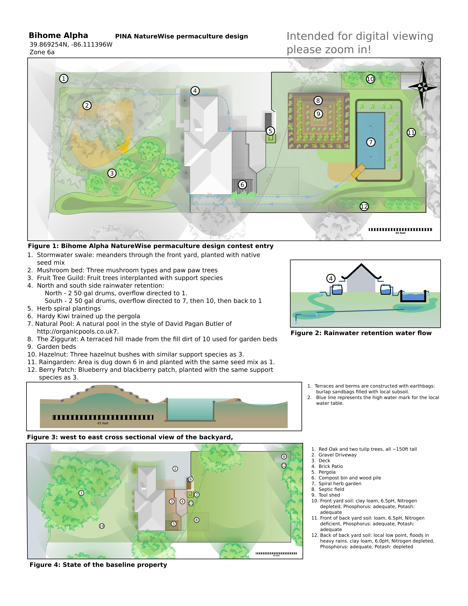

###################################################
Bihome Alpha - PINA NatureWise Design Contest Entry
###################################################

.. raw:: latex

    \newpage

*********************
Explanation of Design
*********************

Climate change, coupled with ever growing global supply chains are continually increasing the strain
on the ecological webs that sustain life on planet Earth. Traditionally, suburban living has been
seen as part of the problem. Our entry, named BiHome Alpha, attempts to change that by exploring
sustainable living practices within a suburban landscape.

BiHome Alpha serves as the initial testbed for a web application we are developing, named
BiHome. This application helps users to understand permaculture design principles. It acts as an
automated permaculture consultant in order to provide land management techniques, training, and
project designs tailored for each user's situation. The intention is to lower the permaculture
knowledge barrier, thereby empowering homeowners to apply permaculture principles and start
transforming sterile suburban landscapes into sustainable, practical, and self regulating suburban
biomes. Accomplishing these objectives will help to harmonize the human and ecological communities
living within, or replaced by, suburban homes.

In this design, we apply permaculture principles to a 0.6 acre partially wooded property. Principle
focus areas of the plan are as follows:

* Continuous improvement: Throughout the seasons, data will be collected in order to compare
  performance between the baseline and transformed landscape. Input data will include time, money,
  and external material for initial development and maintenance of both. Output data will include
  metrics of human and ecological interest, including analysis of soil health and carbon content,
  water management, as well as measuring the yield of the human-consumable goods produced within the
  landscape.
* Intentional integration of Mycelium into newly developed plots to aid in plant growth, increase
  soil health, and provide edible mushrooms.
* Integration of cost effective water management and retention techniques
* Applying the permaculture principle of designing for multiple uses.

Other than these themes, the design incorporates a yard-wide `Rainwater Retention`_ system, a small
`Fruit Tree Guild`_, a `Natural Pool`_, and "`The Ziggurat`_" -- a hill created from the backfill of
the pool that does double duty as a terraced garden, as well as a collection of three smaller
perennial installations.

Although no part of this entry was developed with our software, we have attempted to use the contest
to develop an aesthetic for our maps, as well as better understand the data requirements for the app
to function successfully. Indeed, execution of this project has provided invaluable first-hand
experience for creating the functionality and use cases necessary for our permaculture application's
eventual success.

**************
Plan of Design
**************

.. raw:: latex

    \newpage

****************************
Proposed Budget and Timeline
****************************

Execution of this design spans over two years. In the first year, all projects other than the
natural pool and ziggurat will be completed. Note that a trimmed-down version of the ziggurat
terraced garden will be installed the first year using standard raised garden beds. Extra soil for
the beds will be moved from preparing the back yard rain garden.

:Per Project Cost:
   #. Stormwater Swale: **$227**
   #. Mushroom Patch: **$218.84**
   #. Fruit Tree Guild: **$300.05**
   #. Rainwater Retention: **$529.55**
   #. Herb Spiral: **$13**
   #. Pergola: **$16**
   #. Natural Pool: **$11,634.94**
   #. The Ziggurat: **$2080**
   #. Terrace Plantings: **$200.43**
   #. Hazelnut Patch: **$20**
   #. Rain Garden: Included in the Stormwater swale project
   #. Berry Patch: **$114.38**
:Total cost for the first year projects: $1,701.2 * 10% uncertainty = **$1,870**
:Total cost for the second year projects: $13664.94 * 20% uncertainty = **$16,400**
:Total cost: **$18,270**

Note that the cost of this entire project greatly exceeds the contest prize money, but according to
the plan, 10 of the 12 planned projects can be completed for roughly half of the $5000
prize. Receiving the prize would ensure that the first year's projects are completed, as well as
provide incentive to execute the following year on the complete design. Securing the additional
funds is not a risk, as we have the capability to self-fund the remainder of the project.

Refer to `Appendix A: Detailed Cost and Activity Breakdown`_ for further details on each project,
including a breakdown of the tasks and supplies necessary for their completion. Refer to `Appendix
B: Assessment Against the Permaculture Design Principles`_ for a self assessment of the design
against the 12 permaculture design principles.

.. raw:: latex

    \newpage

************************************************
Appendix A: Detailed Cost and Activity Breakdown
************************************************

Stormwater Swale
================

:Description: This stormwater drainage system meanders through the front yard, where its flow is
   slowed by planting with a native flower/grass seed mix specially designed for detention
   basins. By slowing the water's flow, it can be better absorbed on the lower bank, thereby
   creating 'lenses' of underground water for the `Mushroom Patch`_ and `Fruit Tree Guild`_ to draw
   upon. Water comes into the swale in the north western corner of the yard from the road as well as
   the northern half of the home's roof. The flow of the water is slowed by the plants so that it
   partially functions as a swale, even though there is a slope from the north western corner to the
   end at the south western corner of the front yard. Water overflow from the backyard rain basin is
   channeled to this southern corner of the swale, where the overflow connects to existing city
   stormwater management systems. The water management system is further described in the `Rainwater
   Retention`_ project below.

:Area: ~1800 ft :sup:`2`
:Schedule:
   .. csv-table::
      :header: Task, Hours, Schedule, Notes

      Dig swale, 6 hours, As soon as ground isn't frozen, "Average swale depth: 6 in, width: ~6
      feet. The start and end should be deeper to create pooling areas where the storm water overflow
      joins the swale"
      Plant Cover crop, 0.5 hours, "Start area off with cover crop to out-compete the residual grass
      and add nitrogen. Cover is mix of rye (comes with seed mix, and clover)"
      Plant seed mix, 0.5 hours, "Mix of Detention basin mix for the higher sunlight areas at the start
      and end, and shady woodland mix for the middle areas"
:Schedule Summary: This is the first item to complete and has the least amount of prerequisites for
                   starting. Digging the swale can be done in a day once the ground unfreezes.

                   The principle work for this project can be completed in a weekend by one
                   person, although the seed mix will not be fully established for three years.
:Supplies:
   .. csv-table::
      :header: Description, Quantity, Cost, Amount, Link

      Detention Basin Seed Mix, 1/10 acre, 196, for 1/8 acre coverage, https://www.prairiemoon.com/detention-basin-mix.html
      Crimson Clover cover crop, 2, 3.00, for 1 lb, https://onegreenworld.com/product/crimson-clover/
      5 lb pick mattock, 1, $25, each, https://www.lowes.com/pd/Kobalt-5-lb-Hardwood-Handle-Steel-Pick-Mattock/50325437
:Cost: $227

Mushroom Patch
==============

:Description: Four types of mushroom as well as two Pawpaw trees reside underneath a mature forest
   canopy of red oak and tulip trees. This project take advantages of the mature trees and the
   plantings should thrive in the moist dappled sunlight of this environment. The focus of this bed
   is to learn and explore mushroom cultivation, and hopefully supply bountiful crops of gourmet
   mushrooms as well as Pawpaw fruit.

:Area: ~1700 ft :sup:`2`
:Schedule:
   .. csv-table::
      :header: Task, Hours, Schedule, Notes

      Woodchips, 4 hours, After the stumps are installed, Woodchips are likely free from tree removal services
      Install Stumps, 1 hours, After the Swale,
      Drill and Inoculate Stumps, 2 hours, After stumps are installed,
      Germinate morels in nutrified water, 48 hours, After woodchips are installed, "See p135 of
      Mycelium Running"
      Create Myceliated cardboard, 4 weeks?, About a month prior to installing woodchips, "See p142
      of Mycelium Running"
      Pawpaws, 1, "After the Swale, Early Spring",
:Schedule Summary: This is a slow burning project. The initial tasks will not take long, but caring
   and running the mycelium will take a couple years. The only prerequisites to starting are
   receiving the supplies and finishing building of the swale.
:Supplies:
   .. csv-table::
      :header: Description, Quantity, Cost, Amount, Link

      Shiitake Plug Spawn, 1, 14.95, for 100 plugs, https://fungi.com/collections/plug-spawn-for-logs-stumps/products/shiitake-plug-spawn-100-plugs
      Reishi Plug Spawn, 1, 14.95, for 100 plugs, https://fungi.com/collections/plug-spawn-for-logs-stumps/products/reishi-plug-spawn-100-plugs
      Lion's Mane Plug Spawn, 1, 14.95, for 100 plugs, https://fungi.com/collections/plug-spawn-for-logs-stumps/products/lions-mane-plug-spawn-100-plugs
      True Morel Grain Master Bag, 1, 69.00, for ~1.5 gallon?, https://fungi.com/collections/mushroom-grain-spawn/products/true-morel-grain-master-bag
      Jumbo Ostrich Fern, 1, 19.95, for 1 gallon, https://onegreenworld.com/product/jumbo-ostrich-2/
      Pawpaws from Triple P Assortment, 1, 99.99, for 2 pawpaw and 1 persimmon, https://www.starkbros.com/products/fruit-trees/fruit-tree-assortments/triple-p-assortment
      Woodchips from local tree removal, 4 cu yards, 0, ,
      "Stumps sourced from yard, craigslist and neighbors", 24 stumps, 0, ,
:Cost: $218.84

Fruit Tree Guild
================

:Description: Fruit trees interplanted with support species. The support species from this project
   are also used within three other projects in the back yard -- the `Kiwi Patch`_, the `Hazelnut
   Patch`_, and the `Berry Patch`_.
:Area: 1400 ft :sup:`2`
:Schedule:
   .. csv-table::
      :header: Task, Hours, Schedule, Notes

      Sheet Mulching, 4 hours, After the swale is dug, "See p89 of Gaia's Garden for Recipe"
      Germinate seeds and root stock, ~1 month, A month prior to last frost, "The LED lights from the basement workshop should
      work as a light source"
      Plant everything, 5 hours, Early spring after last frost,
:Schedule Summary: Prerequisites for this project are similar to the `Mushroom Patch`_. It will take
   a few years at least until the trees start producing. In the meantime the area must be tended to,
   principally by "chop and drop" mulching and observing how the guild is growing and taking
   corrective actions as necessary.
:Supplies:
   .. csv-table::
      :header: Description, Order Quantity, Amount, Cost, Link

      Apple - Arkansas Black, 1, 32.99, for 1 semi-dwarf, https://www.starkbros.com/products/fruit-trees/apple-trees/starkspur-arkansas-black-apple
      Apple - Whitney Crabapple, 1, 26.99, for 1 semi-dwarf, https://www.starkbros.com/products/fruit-trees/apple-trees/whitney-crabapple
      Bing Sweet Cherry, 1, 29.99, for 1 semi-dwarf, https://www.starkbros.com/products/fruit-trees/cherry-trees/bing-sweet-cherry
      Windsor Sweet Cherry, 1, 26.99, for 1 semi-dwarf, https://www.starkbros.com/products/fruit-trees/cherry-trees/windsor-sweet-cherry
      Persimmon from Triple P Assortment, 1, 99.99, for 2 pawpaw and 1 persimmon, https://www.starkbros.com/products/fruit-trees/fruit-tree-assortments/triple-p-assortment
      Goumi - Sweet Scarlet, 1, 23.95, for one, https://onegreenworld.com/product/sweet-scarlet-2/
      Goumi - Tillamook, 1, 23.95, for one, https://onegreenworld.com/product/tillamook-goumi/
      Comfrey Bocking #14, 1, 20, for 25 cuttings, http://marshcreekfarmstead.blogspot.com/p/items-for-sale.html
      Green Globe Artichokes, 1, 2.75, for 75 seeds, https://www.rareseeds.com/green-globe-artichoke/
      Florence Fennel, 2, 2.50, for 200 seeds, https://www.rareseeds.com/fennel-florence/
      Japanese Minowase Daikon Radish, 1, 2.50, for 200-500 seeds, https://www.rareseeds.com/japanese-minowase-daikon-r/
      MycoGrow Micronized Seed Mix inoculant, 1, 4.95, for 1 oz, https://fungi.com/products/mycogrow-micronized-endo-ecto-seed-mix-1oz
:Cost: $300.05

Rainwater Retention
===================

:Description: North and South side rainwater retention systems, containing 50 gallon retention
   basins and first flush systems below each roof downspout. Overflow from the basins is fed to the
   front and back yard water features via underground pipe. Drainage changes need to be communicated
   to the city: Stormwater drainage permit: https://my.indy.gov/activity/drainage-permits. These
   changes may qualify for tax credits:
   https://my.indy.gov/activity/stormwater-user-rate-and-credit-manual
:Area: NA
:Schedule:
   .. csv-table::
      :header: Task, Hours, Schedule, Notes

      Cap off north western corner downspout, 10 minutes, After rain barrel installation,
      Install Rain barrels, 5 hours, , "Installation means connecting them to the gutters, ensuring
      they are level and installing filtration between the barrels and gutters"
      Install Drainage, 2 days, After ground is not frozen, "Installation does not need to be below
      frost line as corrugated pipe can flex. Southern side should have pipe to pool on top of pipe
      to front"
      Connect rain barrels to drain, 1 day, After drainage is dug and installed,
:Schedule Summary: This project carries some risk, as it relies on fairly precise elevation
   differences at the input and output ends of the underground drainage pipe. This project can be
   started as soon as supplies are available and the ground is not frozen. This may be a
   multi-weekend project, but likely no more than two weekends.
:Supplies:
   .. csv-table::
      :header: Description, Quantity, Amount, Cost, Link

      Rain barrel, 5 (one for pool), 60, each approx, "craigslist, ebay and https://www.walmart.com/ip/Upcycle-50-Gallon-Terra-Cotta-Rain-Barrel/17626896"
      2in wide PVC Black Tile Tape, 1, 5.95, for a roll, https://www.homedepot.com/p/Advanced-Drainage-Systems-2-in-PVC-Black-Tile-Tape-1137KA/205155061
      Corrugated 4 in Solid drainage pipe - preferably double walled b/c less drag, 450 ft, 38.72, for 100 ft, https://www.lowes.com/pl/Corrugated-drainage-pipe-Outdoor-drainage-Outdoors/4294612449
      Pipe fittings for barrel to pipe, , 10, guess,
      Pipe fitting for pool exit, , 10, guess,
      Pipe fitting for rain garden drain, , 10, guess,
:Cost: $529.55

Herb Spiral
===========

:Description: Herb spiral itself is already installed, it just needs to be planted.
:Area: 32.5 ft :sup:`2`
:Schedule:
   .. csv-table::
      :header: Task, Hours, Schedule, Notes

      Direct seed, 10 minutes, after last frost,
:Schedule Summary: This project only requires the seeds. All herbs can be sown directly.
:Supplies:
   .. csv-table::
      :header: Description, Quantity, Cost, Link

      Slo-Bolt Cilantro, 1, 2.50, for 100 seeds, https://www.rareseeds.com/cilantro-slo-bolt/
      Chinese Chives, 1, 2.50, for 300 seeds, https://www.rareseeds.com/chives-chinese/
      French Dandelion, 1, 2.50, for 150 seeds, https://www.rareseeds.com/french-dandelion/
      Wild Zaatar Oregano, 1, 3.00, for 75 seeds, https://www.rareseeds.com/oregano-wild-zaatar/
      Parsley - Giant of Italy, 1, 2.50, for 400 seeds, https://www.rareseeds.com/parsley-giant-of-italy/
:Cost: $13

Kiwi Patch
==========

:Description: Hardy Kiwi trained up the existing pergola provides shade and fruit. Support plants
   are sown with the kiwi in order to improve the soil. The comfrey will also provide green
   manure. This will be a slow burning project. If the kiwi survive it take years to train them all
   the way up the Pergola.
:Area: NA
:Schedule:
   .. csv-table::
      :header: Task, Hours, Schedule, Notes

      Plant kiwi on southern edge of deck, 20 min, once they arrive,
      Plant support plants, 10 min, once support plants arrive and the ground is thawed,
      Train vines up the pergola, NA, over the years,
:Schedule Summary: This project uses the same support plants as listed for the fruit guild. Once the
   supplies arrive and the ground is thawed
:Supplies:
   .. csv-table::
      :header: Description, Quantity, Cost, Link

      Hardy Kiwi Collection, 1, 16.00, for 3 plants, https://www.rareseeds.com/kiwi-hardy-collection-3-plants-ships-m-june-/
:Cost: $16

Natural Pool
============

:Description: A natural pool in the style of David Pagan Butler (http://organicpools.co.uk). The
   tasks listed below are an abbreviated version of what appears in his manual. The pool depth is 8
   feet. Execution of this project provides a habitat for small wetland creatures, as well as a more
   sustainable (and cheaper) version of the suburban dream of owning a pool. Potentially the pool
   can be stocked with fish and used as an aquaculture as well as providing a recreation area,
   although that isn't factored into the project as the nutrient balance for such an endeavor must
   be carefully managed.

   The overall area is 32 ft x 52 ft. The project gracefully integrates into the surrounding rain
   basin, although the water from each is separated by a berm. The swimming area is 20 ft x 40
   ft. The regeneration zone wraps around the northern and eastern edges, the southern edge is
   reserved for wading. Max depth of the regeneration zone is 2 ft. North and south edges are 6 ft,
   eastern edge is 12ft before reaching the swimming zone. Mortar was estimated using
   https://www.inchcalculator.com/concrete-block-calculator/

:Area: 2000 ft :sup:`2`
:Schedule:
   .. csv-table::
      :header: Task, Hours, Schedule, Notes

      Get building permit, , ,
      Excavate out the swimming zone, , ,
      Dig an extra couple feet in the middle and install a temporary trash pump, , , "Need to
      continuously pump out the groundwater before the liner is installed"
      Lay gravel such that groundwater seepage is even, , ,
      Create form for a cement slab+footers on the bottom, , , "Ensure spots are reserved for
      installing hydrostatic relief valves"
      Get slab poured, , , p42
      Build the walls, , , p45
      Insulate behind walls, , , p47
      Sculpt pond regeneration zone, , , p51
      Create the exit drain, , , p58
      Install underliner, , , p64
      Install liner, , , p67
      Install overliner in regeneration zone and earthbag wall to divide zones, , , p78
      "Install regeneration zone bubble pipe, gravel drainage, and plant substrate", , , p92
      Finish pool edges, , , p125
      Make a bubble pool filter, , , p103
      Make a jetty, , , p133
:Schedule Summary: This is a multi-month project and will likely require help, as well as many
   vacation days and weekends to complete. Contract support is not factored into the cost. This
   project will only be started once all other projects are complete (minus the ziggurat formed from
   the backfill from creating the pool). Execution is contingent on receiving proper permits from
   the city as well as securing the funds and time off required for construction.
:Supplies:
   .. csv-table::
      :header: Description, Quantity, Cost, Link

      Organic pools DIY manual by David Butler, 1, 10.80, http://organicpools.co.uk
      Building Permit, , ,
      Backhoe Loader with >12ft dig depth or else have to manually dig bottom, 2 days minimum, 500, a day,  https://www.hercrentals.com/us/rentals/earthmoving/backhoes/backhoe-loaders.html
      Trash pump rental, > 1 week, 340, per week, https://www.sunbeltrentals.com/equipment/detail/1314/0430240/4in-gas-trash-pump/
      Hydrostatic relief valve, 2, 12.10, per valve, https://www.amazon.com/Hayward-SP1056-Hydrostatic-Relief-Valve/dp/B002EL3YHO/ref=pd_sbs_86_1/134-2097787-3735666
      Cinder blocks, 1330 blocks, 1.21, per block, https://www.lowes.com/pd/Common-8-in-x-8-in-x-16-in-Actual-7-625-in-x-7-625-in-x-15-625-in-Standard-Cored-Concrete-Block/3608978
      Mortar mixer rental, 1 week, 210, per week, https://www.sunbeltrentals.com/equipment/detail/940/0150100/4-cu-ft-electric-mortar-mixer/
      Pond liner, need approx 3600 ft2, 2437, for 45mil 50 ft x 75 ft roll, https://webbsonline.com/Item/Firestone-Mini-Jumbo-Rolls-25075
      Geotextile - 4 oz, need approx 7000 ft2, 581, for 10 ft x 360 ft roll, http://www.diywatergardening.com/non-woven-geotextile-fabric-underlayment-ponds-erosion-drainage.html
      Cement pour, 4 in deep x 20 ft x 40 ft, 3000, "for the pour w/o contractor support or
      supplies", https://www.homewyse.com/services/cost_to_install_cement_slab.html
      cement for wall mortar, 35 bags, 11.47, per 70lb bag, https://www.homedepot.com/p/Quikrete-70-lb-Type-N-Masonry-Cement-112570/100318484
      Sand for wall mortar, 3.6 cu yard, 25, per cu yard, https://www.howmuchisit.org/how-much-does-sand-cost/
      Insulation panels, 50, 15.98, per panel, https://www.homedepot.com/p/Owens-Corning-FOAMULAR-150-1-in-x-4-ft-x-8-ft-R-5-Scored-Square-Edge-Rigid-Foam-Board-Insulation-Sheathing-20WE/207179253
      Filter gravel, 5.4 cu yard, 35, per cu yard, https://www.homeadvisor.com/cost/landscape/pea-gravel/
      60 W Aquarium air compressor, 1, 54.99, per compressor, https://www.amazon.com/VIVOHOME-Electromagnetic-Commercial-Aquarium-Hydroponic/dp/B078H5MH75
      4 in perforated drainage pipe, 300 ft, 38.72, per 100 ft, https://www.homedepot.com/p/4-in-x-100-ft-Corex-Drain-Pipe-Perforated-04010100/202282466
      Air stones, 5, 8.99, each, https://www.ebay.com/itm/VIVOSUN-4-x2-Cylinder-Air-Stone-Diffuser-for-Aquarium-Fish-Tank-Hydroponic-Pond/172668971327
      0.5 in ID air hose, approx 80ft, 61.44, for 100 ft, https://www.homedepot.com/p/UDP-1-2-in-I-D-x-3-4-in-O-D-x-100-ft-Clear-Braided-Vinyl-Tubing-with-Dispenser-Box-T12004003/304185197
      4mm ID air hose, approx 30 ft, 4.65, for 10 meters, https://www.ebay.com/itm/10M-Oxygen-Soft-Pump-Hose-Air-Bubble-Stone-Aquarium-Fish-Tank-Pond-Pump-Tube/352352337573
      Misc rainwater tubing, misc, approx 40, estimated total,
      Berm and zone dividing wall earthbags - included in ziggurat quantity, , , ,
:Cost: $11,634.94

The Ziggurat
============

:Description: A terraced hill made from fill dirt from the natural pool. The terraces alternate
   between planting beds and walkways, with the walkways half as wide as the beds. Average slope is
   1 vertical for each 2 horizontal. Each terrace level is retained with earthbags. The earthbags
   are covered in soil and then planted with a cover crop. Maximum height of the hill is 10.5
   ft. Total width and length are 44 ft and 38 ft respectively.

:Area: 1800 ft :sup:`2`
:Schedule:
   .. csv-table::
      :header: Task, Hours, Schedule, Notes

      Remove the topsoil and place it to the side, , when starting the pool dig,
      Roughly shape the hill with the backhoe, , After completing the pool dig,
      "Construct terraces on each level by first clearing and flattening the area for the bags", "2
      days", ,
      Fill and install bags, 4 days, ,
      Add an underlayer of brush to each planting terrace to aid in water retention, , ,
      Add the topsoil back to each planting terrace, , ,
      Install mulch on the footpaths, , ,
      Install erosion control plants over the bags, , ,
:Schedule Summary: This project uses the subsoil excavated from the `Natural Pool`_ project, so can
   only commence once the swimming area of the pool is dug. Therefore this project will not be
   started until year two. The major schedule item is creation of the terraces. According to the
   estimated supplies, 1200 sand bags must be filled and placed in order to complete all five
   terraces. Once that step is complete, the beds and paths must be prepared, which is likely to
   take an additional set of weekends. Overall estimate for preparing the ziggurat is 6 complete
   weekends.

:Supplies:
   .. csv-table::
      :header: Description, Quantity, Cost, Amount, Link

      Backhoe Loader Rental, , , , See 8. Natural Pool
      14x26 Burlap sandbag 10 oz biodegradable, 3482 bags, 0.58, each, https://www.militarysupplyhouse.com/sandbags_1.htm
      8in x 8in tamper, 1, 25, each, https://www.amazon.com/Ames-8x8-Steel-Tamper-2233400/dp/B00L1LGT0W/ref=pd_sbs_121_1/134-2097787-3735666
      Sandbag filling tool, 1, 25, each, https://www.amazon.com/gp/product/B004TN9SNE/ref=as_li_ss_tl
      Woodchips, 5 cu yards, 0, , Waste from tree removal services
      Brush and logs for bed mulch, 180 cu yards, 0, , Waste from tree removal services
      erosion control grasses, from other mixes, 0, ,
:Cost: $2080

Terrace Plantings
=================

:Description: Three garden areas are built into `The Ziggurat`_, One is an implementation of
   Jajarkot's Advanced Polyculture (from Gaia's Garden by Toby Hemenway). Second is the classic
   three sisters guild with corn, squash, and pole beans. Finally, a polyculture will be developed
   which integrates the other vegetables listed in the supplies below. As long as seeds are saved,
   the cost should be a one time item.

:Area: 536 ft :sup:`2`, 384 ft :sup:`2`, 232 ft :sup:`2`, 80 ft :sup:`2`
:Schedule:
   .. csv-table::
      :header: Task, Hours, Schedule, Notes

      Create planting calendar, 4 hours, in February,
      Build temporary garden beds for first years planting, 6 hours, "During/after rain garden
      implementation",
      "Follow planting calendar for sowing, maintaining, and harvesting", sporadic, "One month prior
      to last frost until winter",
:Schedule Summary: Although The Ziggurat will not be built for another year, a garden will be grown
   this year. The beds will be unsupported raised beds built from the excavated soil from preparing
   the rain garden. Three beds will be developed such that they can be refined this year for later
   execution on the terraces.
:Supplies:
   .. csv-table::
      :header: Description, Quantity, Cost, Amount, Link

      Innoculant - MycoGrow for Vegetables, 1, 5.95, for 1 oz, https://fungi.com/products/mycogrow_for_vegetables
      Corn - Glass Gem, 1, 5, for 75 seeds, https://www.rareseeds.com/glass-gem-corn-/
      Corn - Oaxacan Green, 1, 4, for 75 seeds, https://www.rareseeds.com/oaxacan-green-c/
      Purple Podded Pole Bean, 1, 3.00, for 40-60 seeds, https://www.rareseeds.com/purple-podded-pole-bean/
      Red Kuri (Hokkaido) Squash, 1, 2.75, for 20-35 seeds, https://www.rareseeds.com/red-kuri-squa-hokkaido-/
      Blue Hubbard Squash, 1, 3.00, for 20-35 seeds, https://www.rareseeds.com/blue-hubbard-squash/
      Glory of Enkhuizen Cabbage, 1, 2.50, for 300 seeds, https://www.rareseeds.com/glory-of-enkhuizen-cabbage/
      Hilton Chinese Cabbage, 1, 3.00, for 200 seeds, https://www.rareseeds.com/chinese-cabbage-hilton/
      Calabrese Green Sprouting Broccoli, 1, 2.75, for 300 seeds, https://www.rareseeds.com/calabrese-green-sprouting-broccoli/
      Pepper Cress, 1, 2.00, for 200-600 seeds, https://www.rareseeds.com/pepper-cress/
      Early Mizuna, 1, 2.75, for 250 seeds, https://www.rareseeds.com/mizuna-early/
      Tatsoi, 1, 2.00, for 200 seeds, https://www.rareseeds.com/tatsoi-green/
      Arugula, 1, 2.25, for 200-600 seeds, https://www.rareseeds.com/arugula/
      Shiso (Perilla Purple Zi Su), 1, 2.75, for 75 seeds, https://www.rareseeds.com/shiso-perilla-purple-zi-su/
      Green Purslane, 1, 2.50, for 300 seeds, https://www.rareseeds.com/purslane-green/
      Chinese Red Meat Radish, 1, 3.00, for 200 seeds, https://www.rareseeds.com/chinese-red-meat-radish/
      Easter Basket Radish Mix, 1, 5.50, for 750 seeds, https://www.rareseeds.com/easter-basket-mix-radish-/
      Barese Swiss Chard, 1, 2.75, for 100 seeds, https://www.rareseeds.com/barese-swiss-chard/
      European Mesclun Mix Salad Blend, 1, 3.50, for 1000 seeds, https://www.rareseeds.com/european-mesclun-mix-salad-blend/
      Broad Windsor Fava Bean, 1, 3.25, for 25 seeds, https://www.rareseeds.com/broad-windsor-fava-bean/
      Indian Coriander, 1, 2.75, for 100 seeds, https://www.rareseeds.com/indiancoriander/
      Jaune Paille Des Vertus Onion, 1, 2.50, for 300 seeds, https://www.rareseeds.com/jaune-paille-des-vertus-onion/
      Transylvanian Garlic, 1, 16.99, for 1/2 lb (about 4 bulbs), https://www.burpee.com/vegetables/garlic/garlic-transylvania-prod002385.html
      Genovese Basil, 1, 2.50, for 100 seeds, https://www.rareseeds.com/genovese-b/
      Mary Washington Asparagus, 1, 2.75, for 100 seeds, https://www.rareseeds.com/mary-washington-asparagus/
      Victorian Rhubarb, 1, 3.00, for 25 seeds, https://www.rareseeds.com/victorian-rhubarb/
      Long Island Improved Brussels Sprouts, 1, 2.75, for 150 seeds, https://www.rareseeds.com/long-island-improved-brussels-sprouts/
      Blue Beauty Tomato, 1, 4.00, for 25 seeds, https://www.rareseeds.com/blue-beauty-tomato/
      Berkeley Tie-Die Green Tomato, 1, 3.25, for 15 seeds, https://www.rareseeds.com/berkeley-tie-dye-green-tomato/
      Barry's Crazy Cherry Tomato, 1, 4.00, for 10 seeds, https://www.rareseeds.com/barry-s-/
      Red Rosso Sicilian Tomato, 1, 2.50, for 25 seeds, https://www.rareseeds.com/red-rosso-sicilian-tomato/
      Muscade Carrot, 1, 2.50, for 800 seeds, https://www.rareseeds.com/muscade-carrot/
      Tennessee Red Peanut, 1, 3.50, for 1oz seeds, https://www.rareseeds.com/tennessee-red-peanut/
      Aswad Eggplant, 1, 3.00, for 25 seeds, https://www.rareseeds.com/aswad-eggplant/
      Thai Chao Praya Eggplant, 1, 3.00, for 25-35 seeds, https://www.rareseeds.com/thai-chao-praya-eggplant/
      Dinosaur or Lacinato Kale, 1, 2.75, for 300 seeds, https://www.rareseeds.com/nero-di-toscana-cabbage-dinosaur-or-lacinato-kale-/
      Blue Curled Scotch Kale, 1, 2.50, for 250 seeds, https://www.rareseeds.com/blue-curled-scotch-/
      Fish Pepper, 1, 2.75, for 25 seeds, https://www.rareseeds.com/fish-pepper/
      Craig's Grande Jalapeno, 1, 3.00, for 25 seeds, https://www.rareseeds.com/craig-s-grande-jalapeno-pepper/
      Mustard Habanero, 1, 3.00, for 25 seeds, https://www.rareseeds.com/mustard-habanero-pepper/
      Tabasco pepper, 1, 2.75, for 25 seeds, https://www.rareseeds.com/tabasco-pepper/
      Sheepnose Pimento Sweet Pepper, 1, 2.75, for 25 seeds, https://www.rareseeds.com/sheepnose-pimento-pepper/
      Banana Sweet Pepper, 1, 2.50, for 25 seeds, https://www.rareseeds.com/banana-pepper/
      Emerald Okra, 1, 2.50, for 30-75 seeds, https://www.rareseeds.com/emerald-okra/
      Russian Black Seeded Sunflower, 1, 3.00, for 30 seeds, https://www.rareseeds.com/russian-black-seeded-sunflower/
      Jerusalem Artichoke, 1, 19.79, for 7, https://www.interwovenpermaculture.com/store/p6/jerusalem_artichoke.ht
      Hemp, 1, 10.00, per oz, https://www.bulkhempwarehouse.com/raw-living-viable-planting-hemp-seeds-per-oz/
      Horseradish, 1, 19.95, for 1 gallon, https://onegreenworld.com/product/big-top-2/
:Cost: $200.43

Hazelnut Patch
==============

:Description: Three hazelnut bushes with similar support species as 3.
:Area: 500 ft :sup:`2`
:Schedule:
   See 4. above
:Schedule Summary: Starting this project depends on completion of the `Rain Garden`_, as the soil is
   partially acquired from that project in order to raise the contour profile of the hazelnuts above
   the rain garden wetland.
:Supplies:
   Same helpers as 4. above, as well as:

   .. csv-table::
      :header: Description, Quantity, Cost, Amount, Link

      Hazelnut, 1, 20, for 3, https://www.arborday.org/programs/hazelnuts/join.cfm
:Cost:
   $20

Rain Garden
===========

:Description: Area is dug down 6 in and planted with the same seed mix as 1. Principle pooling area
   should be located at the south eastern corner in order to line up with the drainage pipe
   installation completed as part of the `Rainwater Retention`_ project.
:Area: 2600 ft :sup:`2`
:Schedule:
   Refer to 1 for the general outlines of the schedule.
:Schedule Summary: This project can be started as soon as the ground is thawed, and relatively
   dry. Mostly this will involve a lot of digging and moving of soil to the Hazelnut Patch, Berry
   Patch, and temporary garden.
:Supplies:
   Refer to 1.
:Cost:
   Included in the Stormwater swale project.

Berry Patch
===========

:Description: Blueberry and blackberry patch, planted with the same support species as 3.
:Area: 830 ft :sup:`2`
:Schedule:
   See 4. above. Plant blue and blackberries separate so that the blueberry acid fertilizer is
   concentrated on the correct plants.
:Schedule Summary:
   Depends on completion of the Rain Garden, as the soil is partially acquired from that project in
   order to raise the contour profile of the berry patch above the rain garden wetland.
:Supplies:
   Same helpers as 4. above, as well as:

   .. csv-table::
      :header: Description, Quantity, Cost, Amount, Link

      Blueberry Bundle, 1, 57.63, for 4 plants, https://onegreenworld.com/product/blueberry-bundle/
      Triple Crown Blackberry, 4, 12.95, for 1 bare rootstock, https://onegreenworld.com/product/triple-crown-2/
      Acid Mix Fertilizer 4-3-6 for blueberries, 1, 4.95, for 1 lb, https://onegreenworld.com/product/acid-mix-4-3-6/
:Cost: $114.38

*****************************************************************
Appendix B: Assessment Against the Permaculture Design Principles
*****************************************************************

Observe and Interact
====================

This design was born out of observing the flow of the landscape, with a desire to interact with its
positive aspects in a meaningful way.

Catch and Store Energy
======================

Although the ground at our location is nearly flat, we have found a way to work with the minimal
elevation change and create a water cycle that spans the entire property. Additionally, this design
makes effective use of the available sunlight energy to create edible plants and biomass.

Obtain a Yield
==============

Most of the projects included in this design have a yield of some sort. Even the `Natural Pool`_
creates a yield, both in terms of enjoyment of the outdoors as well as the possibility of
incorporating fish or edible water plants such as cattails at a later date.

Apply Self-Regulation and Accept Feedback
=========================================

Currently suburban landscapes are remarkable in terms of their lack of internal feedback: goods come
in, waste goes out. This landscape attempts to create internal cycles through development of plant
communities which can self regulate and develop productive growth through incoming water and biomass
inputs.

Use and Value Renewable Resources and Services
==============================================

The primary example of this principle is through the `Rainwater Retention`_ system and its
connections to most of the other projects.

Produce No Waste
================

All biomass produced from this design is planned to be incorporated back into the soil through low
energy activities such as chop and drop mulching. In addition, the rain water detention basins help
to reduce stormwater 'waste' in the neighborhood by slowing and absorbing moisture from heavy rains.

Additionally, the backfill subsoil produced from the construction of the natural swimming pool is
turned from a liability into an asset by creation of `The Ziggurat`_ garden terrace. The terraces
help to take advantage of the prime sunlight areas for growing edible crops and also helps with
water management by creating a system where, if watering is necessary, water can be sourced from the
pool, run to the top terrace, and gravity can be used to supply water from there to the lower
terraces.

Design from Patterns to Details
===============================

Polycultures are utilized in this design to a great degree. This follows the pattern in nature where
growth occurs in diverse communities and not in monocultures. In addition, the meandering path of
the `Stormwater Swale`_ in the front yard maximizes the surface area available for water to flow,
with helps to simultaneously provide the maximum water absorption area and provide useful sources of
moisture for the mushroom patch and fruit tree guild while also keeping those projects from becoming
water logged.

Integrate Rather than Segregate
===============================

No single project in this design is intended to stand alone. The water management system integrates
water sources with the polycultures that take advantage of them. The natural pool feeds its excess
water into the rain garden. The `Mushroom Patch`_ takes advantage of the shade and existing micro
cultures sure to be developed underneath the mature red oak tree in order to further develop the
fecundity of the area and provide an edible crop.

Use Small and Slow Solutions
============================

A goal for this design is to provide a locally sourced food crop that can supplement our reliance on
mass agriculture. In addition, the knowledge gained by developing (and occasionally failing) when
implementing this design can be integrated into the BiHome permaculture application we are
developing. This will help spread the small and slow solutions advocated by the permaculture design
principles to a wider audience.

Use and Value Diversity
=======================

When sourcing plants for this design, we endeavored to incorporate heirloom varieties as well as
plants adapted to the local environment. In addition, inclusion of the `Rain Garden`_ feature should
provide a draw to the local wildlife - providing a micro-ecosystem where small local wildlife can
thrive.

Use Edges and Value the Marginal
================================

Edges are most apparent in the `Stormwater Swale`_ feature of the front yard as well as the beds of
`The Ziggurat`_ garden terrace. The backyard `Rain Garden`_ turns a liability into an asset by
transforming the back quarter of the backyard from a stagnant pool over patchy grass into a vibrant
semi-wetland full of flowers, birds, and small amphibians.

Creatively Use and Respond to Change
====================================

Suburban landscapes are not going to disappear anytime soon, but the practices that have sustained
them for the past sixty years can no longer be ethically justified. By re-envisioning suburbia as
not simply supplanting nature, but as the incorporation of medium density populations into
semi-managed natural landscapes we can change both the paradigm and economy we rely on to support
our first world way of life. Although it is only a baby step, this design tries to take a positive
step in the right direction, introducing a narrative of how little it really costs to make living
for humans, and living for nature easier and more sustainable.
